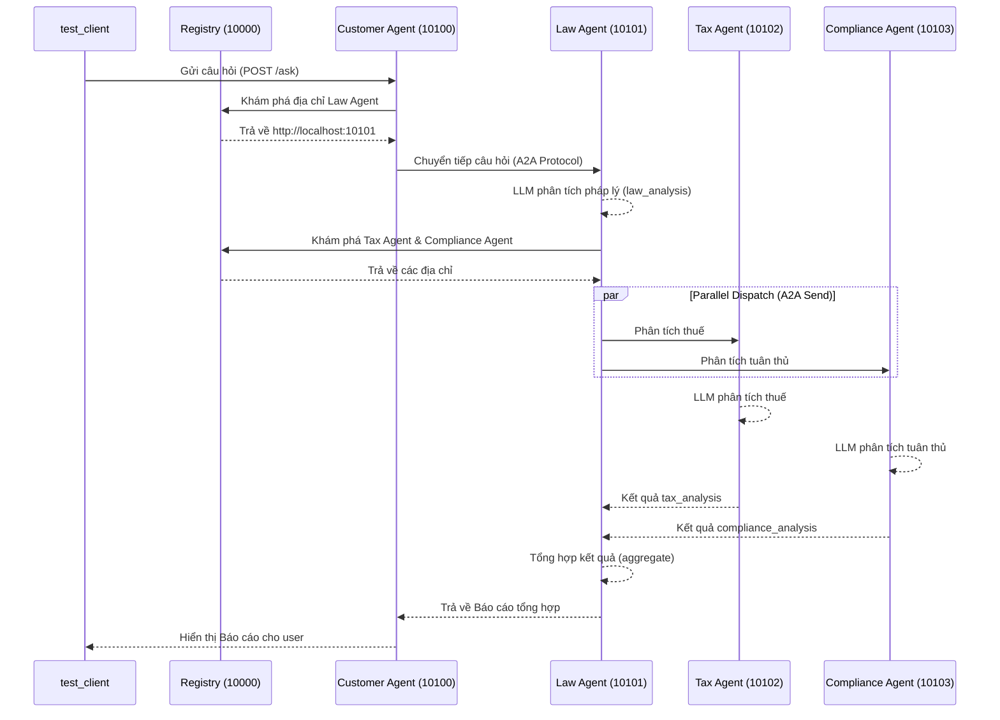

# Báo Cáo Thực Hành: Hệ Thống Multi-Agent với A2A Protocol

**Họ và tên:** [Điền tên của bạn]  
**Mã sinh viên:** [Điền mã sinh viên của bạn]

---

## 1. Trả lời câu hỏi Phần 1 (Stage 1)

1. **LLM được khởi tạo như thế nào?**
   - LLM được khởi tạo thông qua hàm `get_llm()` trong file `common/llm.py`. Hàm này sử dụng `ChatOpenAI` từ `langchain_openai`, kết nối tới OpenRouter API bằng base_url `https://openrouter.ai/api/v1` và API key lấy từ biến môi trường `OPENROUTER_API_KEY`. Model mặc định sử dụng là `google/gemini-2.5-flash`.

2. **Message được gửi đến LLM có cấu trúc gì?**
   - Message được gửi dưới dạng một List (danh sách) các đối tượng Message. Cụ thể bao gồm `SystemMessage` (chứa prompt hệ thống định nghĩa vai trò của AI) và `HumanMessage` (chứa câu hỏi hoặc yêu cầu từ người dùng).

3. **Tại sao cần có `SystemMessage` và `HumanMessage`?**
   - `SystemMessage`: Dùng để định hình bối cảnh, vai trò, tone giọng và quy tắc cho LLM (ví dụ: "Bạn là chuyên gia pháp lý..."). Giúp LLM biết nó nên hành xử thế nào.
   - `HumanMessage`: Dùng để truyền đạt yêu cầu, câu hỏi thực tế của người dùng ở hiện tại. Việc tách biệt giúp LLM phân biệt được đâu là "luật chơi" (system) và đâu là "dữ liệu đầu vào" (human).

---

## 2. Phân tích Phần 2 (Stage 2)

1. **Hàm `@tool` decorator được dùng ở đâu?**
   - `@tool` decorator được dùng ngay trên định nghĩa hàm `search_legal_knowledge`. Nó biến một Python function thông thường thành một Tool mà LangChain/LLM có thể nhận diện và gọi thông qua Tool Calling.

2. **`LEGAL_KNOWLEDGE` được cấu trúc như thế nào?**
   - Cấu trúc dưới dạng List of Dictionaries. Mỗi dictionary đại diện cho một knowledge entry, bao gồm các field:
     - `id`: Định danh.
     - `keywords`: Danh sách từ khóa (dùng để map với câu hỏi).
     - `text`: Nội dung/kiến thức pháp lý cụ thể.

3. **LLM được bind với tools ra sao?**
   - Thông qua phương thức `.bind_tools(tools)` (ví dụ: `llm.bind_tools([search_legal_knowledge])`). Quá trình này truyền JSON schema của các tools vào payload của API, báo cho LLM biết nó có những công cụ nào để sử dụng.

---

## 3. Phân tích Phần 3 (Stage 3)

1. **Tìm `create_react_agent()` — đây là magic function:**
   - Hàm này được import từ `langgraph.prebuilt`. Nó tự động tạo ra một đồ thị (graph) LangGraph implement vòng lặp ReAct (Reasoning and Acting) mà không cần chúng ta phải tự viết vòng lặp `while` hoặc `if/else` để check `tool_calls`.

2. **So sánh với Stage 2:**
   - Ở Stage 2, ta phải tự kiểm tra `response.tool_calls`, tự lặp qua các tools, tự thực thi chúng, gán `ToolMessage` và gọi lại LLM (manual tool loop). Ở Stage 3, LangGraph xử lý toàn bộ quá trình này ngầm bên dưới, LLM sẽ tự quyết định chạy bao nhiêu vòng lặp cho đến khi hoàn thành.

---

## 4. Phân tích Phần 5 (Stage 5) & Diagram

**(Thực hiện Bài tập 5.1: Sequence Diagram)**

> *Vẽ sequence diagram flow qua các agent dựa trên trace_id khi chạy `test_client.py`:*

---

## 5. Trả lời Câu Hỏi Ôn Tập (Phần 6.3)

1. **Khi nào nên dùng single agent thay vì multi-agent?**
   - Nên dùng Single Agent khi bài toán đơn giản, quy mô nhỏ, domain hẹp, và các tools có liên quan chặt chẽ với nhau. Nếu bài toán có quá nhiều rules, tools, và yêu cầu các chuyên môn khác biệt rõ rệt (như luật, thuế, kỹ thuật), thì nên chia thành Multi-Agent để dễ quản lý system prompt và giảm thiểu ảo giác (hallucination).

2. **Ưu điểm của A2A protocol so với gRPC hoặc REST thông thường?**
   - A2A là chuẩn giao tiếp thiết kế chuyên biệt cho Agents, hỗ trợ truyền state/context của chuỗi suy nghĩ giữa các agent một cách tự nhiên. Nó cũng được tối ưu với Agent Registry để dynamic discovery (khám phá dịch vụ động), giúp các agents tự tìm nhau mà không cần hardcode địa chỉ.

3. **Làm thế nào để prevent infinite delegation loops trong A2A?**
   - Sử dụng `trace_id` và đếm số bước nhảy (hop count / max_steps). Nếu một request bị delegation quá số lần quy định, hệ thống sẽ tự động ngắt. 
   - Thiết kế graph có tính hướng đi rõ ràng (DAG - Directed Acyclic Graph) để không có node nào trỏ ngược lại node cha mà không có điều kiện dừng ngặt nghèo.

4. **Tại sao cần Registry service? Có thể hardcode URLs không?**
   - Registry service giúp hệ thống scalable và linh hoạt. Khi một agent thay đổi port, sập, hoặc được scale up lên nhiều instance, Registry sẽ tự động cập nhật. Hardcode URLs sẽ làm hệ thống giòn (brittle) và rất khó deploy trong môi trường cloud/containerized (như Kubernetes) nơi IP và port thay đổi liên tục.
